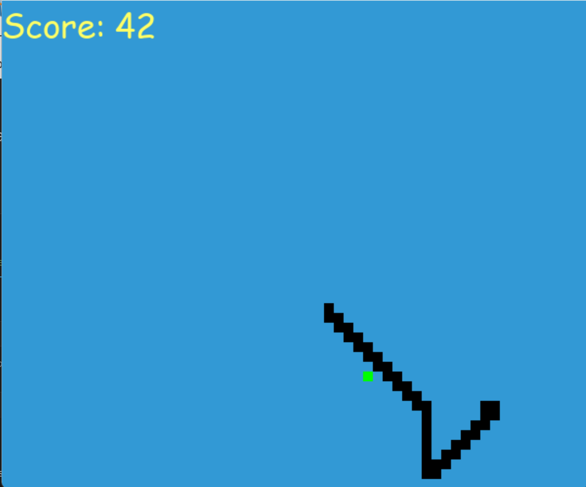

# Artificial Intelligence Snake

This project simulates Snake using a Q-learning approach. Q-learning is a reinforcement learning algorithm that builds upon the previous versions by saving state in a Q-table. 

Run the simulation by going to snake-game.ipynb and running all cells. Training the algorithm takes around a minute, and the resulting model is saved to a pkl file. This can then be loaded and run as many times as you want.

## Screenshots

